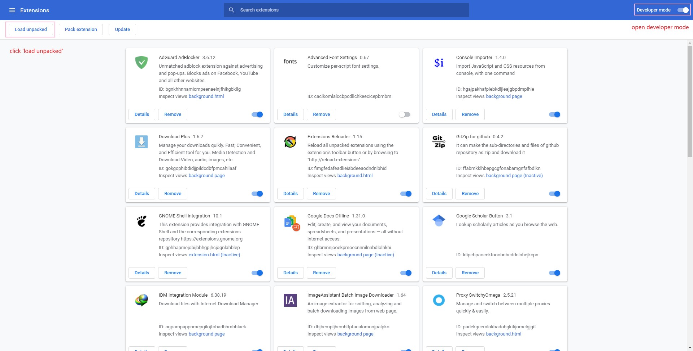

<h1 align="center">WHU-GPA-helperX</h1>

a unpretentious GPA calculator of WHU new EAS, migration of <a href="https://github.com/HackerLiye/WHU-GPA-helper" target="_blank">WHU-GPA-helper</a>

## Features

- complete migration of <a href="https://github.com/HackerLiye/WHU-GPA-helper" target="_blank">WHU-GPA-helper</a> crafted by [HackerLiye](https://github.com/HackerLiye)
- add the ability to display statistics

## Usage

You can use this extension either through chrome developer mode or chrome web store.

### chrome developer mode

First, you need to have the code locally(`git clone` or download from [release page](https://github.com/whaliendev/WHU-GPA-helperX/releases)). Then extract the source code to a proper directory if needed.
Next, go to your chrome [extension management page](chrome://extensions), open the developer mode and click load unpacked as shown below.

<svg fill="none" viewBox="0 0 800 400" width="800" height="400" xmlns="http://www.w3.org/2000/svg">
	<foreignObject width="100%" height="100%">
		

			
			
		

	</foreignObject>
</svg>

### chrome web store

Just go to [chrome web store](https://chrome.google.com/webstore/detail/%E6%AD%A6%E6%B1%89%E5%A4%A7%E5%AD%A6%E6%88%90%E7%BB%A9%E5%8A%A9%E6%89%8Bx/jopdhihepdphcbmbhkhjppilomdgdiaj) and add this extension to your chrome.
But if you get extension through this way, one thing needed to be mentioned is that the version you can get from chrome web store is behind this page most of the time due to [the new release regulation of chrome]().

After installation, this extension will be automatically triggered when you are at [the WHU new EAS](https://jwgl.whu.edu.cn/xtgl/index_initMenu.html).

## Credits

Many thanks to [HackerLiye](https://github.com/HackerLiye)'s inspiration and open source project <a href="https://github.com/HackerLiye/WHU-GPA-helper" target="_blank">WHU-GPA-helper</a>.

## License

[GPLv3](LICENSE)

Copyright © 2021 Hwa

---

<b>If you like my project, feel free to give my repo a star~ :star: :arrow_up:. </b>

